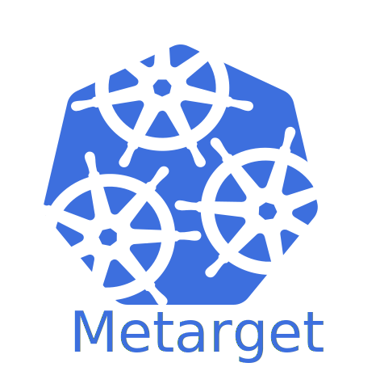

<p align="center">
  
</p>

[中文](README-zh.md) | [English](README.md)

## 1 项目介绍

Metarget的名称来源于`meta-`（元）加`target`（目标，靶机），是一个脆弱基础设施自动化构建框架，主要用于快速、自动化搭建从简单到复杂的脆弱云原生靶机环境。

「绿盟科技研究通讯」上发布了一篇阐述Metarget的设计理念和技术目标的文章，见[Metarget：云原生攻防靶场开源啦！](https://mp.weixin.qq.com/s?__biz=MzIyODYzNTU2OA==&mid=2247489415&idx=1&sn=4aea7b7ecff51710c79037ab07a889bc)。

如果您希望就Metarget项目做进一步的交流，可添加开发者微信：


我们会拉您进入Metarget技术交流微信群。

### 1.1 项目的缘起

在研究漏洞时，我们经常会发现“环境搭建”这一步骤本身就会占用大量的时间，与之相比，真正测试PoC、ExP的时间可能非常短。由于许多官方镜像在国内的网络环境下并不方便获得，加上云原生组件自身的复杂性，在云原生安全领域，前述问题尤为明显。

与此同时，我们也能看到，开源社区涌现出一些优秀的安全项目，如[Vulhub](https://github.com/vulhub/vulhub)、[VulApps](https://github.com/Medicean/VulApps)等，将漏洞场景打包成镜像，方便研究人员开箱即用。

然而，这些项目主要针对应用程序漏洞。那么，如果我们需要研究的是Docker、Kubernetes、操作系统内核等底层基础设施自身的漏洞呢？这又回到了前面的环境搭建问题。

我们希望Metarget能够在一定程度上解决这个问题，致力于底层基础设施的脆弱场景自动化构建。在此之上，我们还希望Metarget实现对云原生环境多层次脆弱场景的自动化构建。

### 1.2 “安装漏洞”

在Metarget项目中，我们提出“安装漏洞”、“安装脆弱场景”的概念。漏洞为什么不能像软件一样直接安装呢？程序为实，漏洞为虚；软件为满，漏洞为缺。那么只需换一种视角，视虚为实，以缺为满，我们完全可以像安装软件一样安装漏洞——以安全研究、攻防实战为目的。

具体来说，我们希望：

- 执行`metarget cnv install cve-2019-5736`直接将带有CVE-2019-5736漏洞的Docker安装在服务器上。
- 执行`metarget cnv install cve-2018-1002105`直接将带有CVE-2018-1002105漏洞的Kubernetes安装在服务器上。
- 执行`metarget cnv install kata-escape-2020`直接将带有CVE-2020-2023/2025/2026等漏洞的Kata-containers安装在服务器上。
- 执行`metarget cnv install cve-2016-5195`直接将系统切换为带有脏牛漏洞的内核。

有点酷了，是不是？不要讲那么多，不要RTFM，我只想一键搞定环境泡杯咖啡，然后开始漏洞研究。

在这个基础上，我们还希望：

- 攻防相关的同学能够借助Metarget快速搭建从简单到复杂的云原生靶场环境，从而积累云原生环境下的渗透经验。
- 执行`metarget appv install dvwa`直接安装一个[DVWA](https://github.com/digininja/DVWA)靶机到脆弱的底层基础设施上。
- 执行`metarget appv install thinkphp-5-0-23-rce --external`直接安装一个ThinkPHP RCE漏洞环境到脆弱的底层基础设施上，并以`NodePort`形式将端口暴露出来。

在一个刚刚装好的Ubuntu操作系统上，安装Metarget，然后简单执行五条指令就能完成一个多层次脆弱靶机场景搭建：

```bash
./metarget cnv install cve-2016-5195 # 内核漏洞层面容器逃逸
./metarget cnv install cve-2019-5736 # Docker层面容器逃逸
./metarget cnv install cve-2018-1002105 --domestic # Kubernetes单节点集群（包含权限提升漏洞）
./metarget cnv install privileged-container # 部署一个特权容器
./metarget appv install dvwa --external # 部署一个DVWA靶机
```

RCE、容器逃逸、横向移动、隐蔽持久化，统统打包送给你。

在这个基础上，我们还希望......

先留个悬念，请拭目以待 :)

注意：

本项目目的在于自动化构建**用于信息安全研究的脆弱场景**，不保证生成的场景（如自动化安装的Kubernetes）的安全性，**不推荐**将本项目用于正常业务组件、集群的安装和部署。

## 2 安装方法

### 2.1 依赖项

- Ubuntu 16.04或18.04
- **Python >= 3.6** (不支持Python 2.x！)
- pip3

### 2.2 从源码安装

拉取仓库，安装必要库文件：

```bash
git clone https://github.com/brant-ruan/metarget.git
cd metarget/
pip install -r requirements.txt
```

使用Metarget，搭建脆弱场景，例如：

```bash
./metarget cnv install cve-2019-5736
```

### 2.3 从PyPI安装

暂不支持。

## 3 使用方法

### 3.1 基本操作

```
usage: metarget [-h] [-v] subcommand ...

automatic constructions of vulnerable infrastructures

positional arguments:
  subcommand     description
    gadget       cloud native gadgets (docker/k8s/...) management
    cnv          cloud native vulnerabilities management
    appv         application vulnerabilities management

optional arguments:
  -h, --help     show this help message and exit
  -v, --version  show program's version number and exit
```

执行`./metarget gadget list`了解当前支持的云原生组件。

### 3.2 管理云原生组件

```
usage: metarget gadget [-h] subcommand ...

positional arguments:
  subcommand  description
    list      list supported gadgets
    install   install gadgets
    remove    uninstall gadgets

optional arguments:
  -h, --help  show this help message and exit
```

#### 3.2.1 示例：安装指定版本Docker

执行以下命令：

```bash
./metarget gadget install docker --version 18.03.1
```

执行成功后，版本为18.03.1的Docker将被安装在当前Linux系统上。

#### 3.2.2 示例：安装指定版本Kubernetes

执行以下命令：

```bash
./metarget gadget install k8s --version 1.16.5
```

执行成功后，版本为1.16.5的单节点Kubernetes将被安装在当前Linux系统上。

注意：

Kubernetes通常需要配置大量参数，Metarget项目提供了部分参数供指定：

```
  -v VERSION, --version VERSION
                        gadget version
  --cni-plugin CNI_PLUGIN
                        cni plugin, flannel by default
  --pod-network-cidr POD_NETWORK_CIDR
                        pod network cidr, default cidr for each plugin by
                        default
  --taint-master        taint master node or not
  --domestic            magic
```

**考虑到特殊的网络环境，国内的朋友如果无法访问Kubernetes官方镜像源，可以指定以下参数，以顺利完成Kubernetes的部署：**

- `--domestic`：当使用该选项时，Metarget将自动从国内源（阿里云）下载Kubernetes系统组件镜像，无需代理（偶尔会下载失败，需多次尝试）

如果主机能够直接访问Kubernetes官方镜像源，则不必指定该参数。

**Metarget支持部署多节点Kubernetes集群环境，如果想要部署多节点，在单节点部署成功后，将`tools`目录下生成的`install_k8s_worker.sh`脚本复制到每个工作节点上执行即可。**

#### 3.2.3 示例：安装指定版本的Kata-containers

执行以下命令：

```bash
./metarget gadget install kata --version 1.10.0
```

执行成功后，版本为1.10.0的Kata-containers将被安装在当前Linux系统上。

注意：

你也可以通过`--kata-runtime-type`选项指定kata运行时的类型（如qemu、clh、fc等），默认值为`qemu`。

**考虑到特殊的网络环境，国内的朋友如果无法下载Kata-containers安装包，可以通过`--https-proxy`参数指定代理，也可以预先从Github上下载Kata-containers压缩包放置在`data/`目录下，Metarget将自动使用已下载的包。**

#### 3.2.4 示例：安装指定版本Linux内核

执行以下命令：

```bash
./metarget gadget install kernel --version 5.7.5
```

执行成功后，版本为5.7.5的内核将被安装在当前Linux系统上。

注意：

当前Metarget采用两种方法安装内核：

1. apt
2. 在apt无备选包的情况下，直接远程下载Ubuntu deb内核包进行安装

内核安装成功后需要重新启动系统以生效，Metarget会提醒是否自动重启系统。

### 3.3 管理“云原生组件”的脆弱场景

```
usage: metarget cnv [-h] subcommand ...

positional arguments:
  subcommand  description
    list      list supported cloud native vulnerabilities
    install   install cloud native vulnerabilities
    remove    uninstall cloud native vulnerabilities

optional arguments:
  -h, --help  show this help message and exit
```

执行`./metarget cnv list`了解当前支持的云原生组件脆弱场景。

#### 3.3.1 示例：CVE-2019-5736

执行以下命令：

```bash
./metarget cnv install cve-2019-5736
```

执行成功后，存在CVE-2019-5736漏洞的Docker将被安装在当前Linux系统上。

#### 3.3.2 示例：CVE-2018-1002105

执行以下命令：

```bash
./metarget cnv install cve-2018-1002105
```

执行成功后，存在CVE-2018-1002105漏洞的Kubernetes单节点集群将被安装在当前Linux系统上。

**考虑到特殊的网络环境，国内的朋友如果无法访问Kubernetes官方镜像源，可以指定以下参数，以顺利完成Kubernetes的部署：**

- `--domestic`：当使用该选项时，Metarget将自动从国内源（阿里云）下载Kubernetes系统组件镜像，无需代理（偶尔会下载失败，需多次尝试）

如果主机能够直接访问Kubernetes官方镜像源，则不必指定该参数。

#### 3.3.3 示例：Kata-containers安全容器逃逸

执行以下命令：

```bash
./metarget cnv install kata-escape-2020
```

执行成功后，存在CVE-2020-2023/2025/2026等漏洞的Kata-containers将被安装在当前系统上。

**考虑到特殊的网络环境，国内的朋友如果无法下载Kata-containers安装包，可以通过`--https-proxy`参数指定代理，也可以预先从Github上下载Kata-containers压缩包放置在`data/`目录下，Metarget将自动使用已下载的包。**

#### 3.3.4 示例：CVE-2016-5195

执行以下命令：

```bash
./metarget cnv install cve-2016-5195
```

执行成功后，存在CVE-2016-5195漏洞的Linux内核将被安装在当前系统上。

### 3.4 管理“云原生应用”的脆弱场景

```
usage: metarget appv [-h] subcommand ...

positional arguments:
  subcommand  description
    list      list supported application vulnerabilities
    install   install application vulnerabilities
    remove    uninstall application vulnerabilities

optional arguments:
  -h, --help  show this help message and exit
```

执行`./metarget appv list`了解当前支持的云原生应用脆弱场景。

注意：

在构建云原生应用的脆弱场景前，需要先安装Docker及Kubernetes，可以使用Metarget相关命令来完成。

#### 3.4.1 示例：DVWA

执行以下命令：

```bash
./metarget appv install dvwa
```

执行成功后，DVWA将以Deployment和Service资源的形式被部署在当前集群中。

注意：

- 你可以通过指定`--external`选项让服务以`Nodeport`形式暴露出来，这样一来，你就能够通过工作节点的IP访问到该服务（默认情况下，服务类型为`ClusterIP`）。
- 你可以指定`--host-net`选项，这样一来，该脆弱应用将共享宿主机网络命名空间。
- 你可以指定`--host-pid`选项，这样一来，该脆弱应用将共享宿主机PID命名空间。

### 3.5 管理“云原生靶机集群”的脆弱场景

正在开发，暂不支持。

## 4 场景列表

### 4.1 云原生组件脆弱场景

如果某个脆弱场景名称的末尾带了星号（\*），你还需要关注表格下面提供的关于此场景的其他说明。

|场景名称|涉及组件|场景类型|CVSS 3.x|Writeup|
|:-:|:-:|:-:|:-:|:-:|
|[cve-2018-15664](vulns_cn/docker/cve-2018-15664.yaml)|docker|容器逃逸|[7.5](https://nvd.nist.gov/vuln/detail/CVE-2018-15664)||
|[cve-2019-13139](vulns_cn/docker/cve-2019-13139.yaml)|docker|命令执行|[8.4](https://nvd.nist.gov/vuln/detail/CVE-2019-13139)|[链接](writeups_cnv/docker-cve-2019-13139)|
|[cve-2019-14271](vulns_cn/docker/cve-2019-14271.yaml)|docker|容器逃逸|[9.8](https://nvd.nist.gov/vuln/detail/CVE-2019-14271)|[链接](writeups_cnv/docker-cve-2019-14271)|
|[cve-2020-15257](vulns_cn/docker/cve-2020-15257.yaml)|docker/containerd|容器逃逸|[5.2](https://nvd.nist.gov/vuln/detail/CVE-2020-15257)|[链接](writeups_cnv/docker-containerd-cve-2020-15257)|
|[cve-2019-5736](vulns_cn/docker/cve-2019-5736.yaml)|docker/runc|容器逃逸|[8.6](https://nvd.nist.gov/vuln/detail/CVE-2019-5736)||
|[cve-2019-16884](vulns_cn/docker/cve-2019-16884.yaml)|docker/runc|容器逃逸|[7.5](https://nvd.nist.gov/vuln/detail/CVE-2019-16884)||
|[cve-2021-30465\*](vulns_cn/docker/cve-2021-30465.yaml)|docker/runc|容器逃逸|[7.6](https://nvd.nist.gov/vuln/detail/CVE-2021-30465)|[链接](writeups_cnv/docker-runc-cve-2021-30465)|
|[cve-2017-1002101](vulns_cn/kubernetes/cve-2017-1002101.yaml)|k8s|容器逃逸|[9.6](https://nvd.nist.gov/vuln/detail/CVE-2017-1002101)|[链接](https://github.com/brant-ruan/cloud-native-security-book/blob/main/appendix/CVE-2017-1002101：突破隔离访问宿主机文件系统.pdf)|
|[cve-2018-1002100](vulns_cn/kubernetes/cve-2018-1002100.yaml)|k8s/kubectl|容器逃逸|[5.5](https://nvd.nist.gov/vuln/detail/CVE-2018-1002100)||
|[cve-2018-1002105](vulns_cn/kubernetes/cve-2018-1002105.yaml)|k8s|权限提升|[9.8](https://nvd.nist.gov/vuln/detail/CVE-2018-1002105)||
|[cve-2019-11253](vulns_cn/kubernetes/cve-2019-11253.yaml)|k8s|拒绝服务|[7.5](https://nvd.nist.gov/vuln/detail/CVE-2019-11253)||
|[cve-2019-9512](vulns_cn/kubernetes/cve-2019-9512.yaml)|k8s|拒绝服务|[7.5](https://nvd.nist.gov/vuln/detail/CVE-2019-9512)||
|[cve-2019-9514](vulns_cn/kubernetes/cve-2019-9514.yaml)|k8s|拒绝服务|[7.5](https://nvd.nist.gov/vuln/detail/CVE-2019-9514)||
|[cve-2019-9946](vulns_cn/kubernetes/cve-2019-9946.yaml)|k8s|流量劫持|[7.5](https://nvd.nist.gov/vuln/detail/CVE-2019-9946)||
|[cve-2020-8554](vulns_cn/kubernetes/cve-2020-8554.yaml)|k8s|中间人攻击|[5.0](https://nvd.nist.gov/vuln/detail/CVE-2020-8554)||
|[cve-2020-8555](vulns_cn/kubernetes/cve-2020-8555.yaml)|k8s|服务端请求伪造（SSRF）|[6.3](https://nvd.nist.gov/vuln/detail/CVE-2020-8555)||
|[cve-2020-8557](vulns_cn/kubernetes/cve-2020-8557.yaml)|k8s|拒绝服务|[5.5](https://nvd.nist.gov/vuln/detail/CVE-2020-8557)||
|[cve-2020-8558](vulns_cn/kubernetes/cve-2020-8558.yaml)|k8s|服务暴露|[8.8](https://nvd.nist.gov/vuln/detail/CVE-2020-8558)||
|[cve-2020-8559](vulns_cn/kubernetes/cve-2020-8559.yaml)|k8s|权限提升|[6.8](https://nvd.nist.gov/vuln/detail/CVE-2020-8559)||
|[cve-2021-25741](vulns_cn/kubernetes/cve-2021-25741.yaml)|k8s|容器逃逸|[8.1](https://nvd.nist.gov/vuln/detail/CVE-2021-25741)||
|[cve-2016-5195](vulns_cn/kernel/cve-2016-5195.yaml)|kernel|容器逃逸|[7.8](https://nvd.nist.gov/vuln/detail/CVE-2016-5195)||
|[cve-2016-8655](vulns_cn/kernel/cve-2016-8655.yaml)|kernel|权限提升|[7.8](https://nvd.nist.gov/vuln/detail/CVE-2016-8655)||
|[cve-2017-6074](vulns_cn/kernel/cve-2017-6074.yaml)|kernel|权限提升|[7.8](https://nvd.nist.gov/vuln/detail/CVE-2017-6074)||
|[cve-2017-7308](vulns_cn/kernel/cve-2017-7308.yaml)|kernel|容器逃逸|[7.8](https://nvd.nist.gov/vuln/detail/CVE-2017-7308)|[链接](writeups_cnv/kernel-cve-2017-7308)|
|[cve-2017-16995](vulns_cn/kernel/cve-2017-16995.yaml)|kernel|权限提升|[7.8](https://nvd.nist.gov/vuln/detail/CVE-2017-16995)||
|[cve-2017-1000112](vulns_cn/kernel/cve-2017-1000112.yaml)|kernel|容器逃逸|[7.0](https://nvd.nist.gov/vuln/detail/CVE-2017-1000112)|[链接](writeups_cnv/kernel-cve-2017-1000112)|
|[cve-2018-18955](vulns_cn/kernel/cve-2018-18955.yaml)|kernel|权限提升|[7.0](https://nvd.nist.gov/vuln/detail/CVE-2018-18955)||
|[cve-2020-14386](vulns_cn/kernel/cve-2020-14386.yaml)|kernel|容器逃逸|[7.8](https://nvd.nist.gov/vuln/detail/CVE-2020-14386)||
|[cve-2021-22555](vulns_cn/kernel/cve-2021-22555.yaml)|kernel|容器逃逸|[7.8](https://nvd.nist.gov/vuln/detail/CVE-2021-22555)||
|[kata-escape-2020](vulns_cn/kata-containers/kata-escape-2020.yaml)|kata-containers|容器逃逸|[6.3](https://nvd.nist.gov/vuln/detail/CVE-2020-2023)/[8.8](https://nvd.nist.gov/vuln/detail/CVE-2020-2025)/[8.8](https://nvd.nist.gov/vuln/detail/CVE-2020-2026)||
|[cap_dac_read_search-container](vulns_cn/configs/cap_dac_read_search-container.yaml)|危险配置|容器逃逸|-|[链接](writeups_cnv/config-cap_dac_read_search-container)|
|[cap_sys_admin-container](vulns_cn/configs/cap_sys_admin-container.yaml)|危险配置|容器逃逸|-||
|[cap_sys_ptrace-container](vulns_cn/configs/cap_sys_ptrace-container.yaml)|危险配置|容器逃逸|-||
|[privileged-container](vulns_cn/configs/privileged-container.yaml)|危险配置|容器逃逸|-|[链接](writeups_cnv/config-privileged-container)|
|[mount-docker-sock](vulns_cn/mounts/mount-docker-sock.yaml)|危险挂载|容器逃逸|-|[链接](writeups_cnv/mount-docker-sock)|
|[mount-host-etc](vulns_cn/mounts/mount-host-etc.yaml)|危险挂载|容器逃逸|-||
|[mount-host-procfs](vulns_cn/mounts/mount-host-procfs.yaml)|危险挂载|容器逃逸|-|[链接](writeups_cnv/mount-host-procfs)|
|[mount-var-log](vulns_cn/mounts/mount-var-log.yaml)|危险挂载|容器逃逸|-|[链接](writeups_cnv/mount-var-log)|

注意：

- 关于内核漏洞类型的说明：大家可能会发现有的内核漏洞标注的类型是`权限提升`，有的则是`容器逃逸`。本质上来说，这两者的区别主要在于攻击载荷（获得一个高权限shell还是先逃逸）。
    - 另外，由于容器默认有一些安全机制（如Seccomp、Capabilities限制），一些内核漏洞可能较难或无法在默认配置下的容器中成功利用。
    - 因此，我们将基于Metarget验证过能够用于容器逃逸的内核漏洞标记为容器逃逸类型，其他的暂时标记为权限提升类型，后续如果利用该漏洞逃逸成功，则更新为容器逃逸类型。
- 对于**cve-2021-30465**来说，在`cnv install cve-2021-30465`（安装了Docker）之后，
    - 你需要手动安装一个K8s（利用Metarget执行`cnv install cve-2018-1002105`或`gadget install k8s --version 1.16.5`），从而实现漏洞利用。

### 4.2 云原生应用脆弱场景

应用脆弱场景主要集成自开源社区中的其他项目：

- [Vulhub](https://github.com/vulhub/vulhub)
- [DVWA](https://github.com/digininja/DVWA)

真诚感谢以上开源项目为安全社区做出的贡献！

Metarget将以上项目中的靶机统一转化为Kubernetes中的Deployment和Service资源，使管理更加方便（感谢[kompose](https://github.com/kubernetes/kompose)）。

可执行以下命令查看Metarget支持构建的应用脆弱场景：

```bash
./metarget appv list
```

注意：

- [Confluence漏洞CVE-2019-3396](vulns_app/confluence/CVE-2019-3396)的部署可参考[Vulhub相关页面](https://github.com/vulhub/vulhub/blob/master/confluence/CVE-2019-3396/README.zh-cn.md)，其中PostgreSQL数据库的地址应填写为`cve-2019-3396-db`（Vulhub中为`db`）。

## 5 DEMO

[](https://asciinema.org/a/407107)

## 6 开发计划

- [x] 实现基本云原生组件安装部署
- [x] 实现经典云原生漏洞场景集成
- [x] 实现容器内RCE脆弱场景集成
- [ ] 实现多节点云原生靶场集群自动化生成
- 实现其他云原生脆弱场景集成（长期更新）

## 7 主要维护者

- [@brant-ruan](https://github.com/brant-ruan)
- [@ListenerMoya](https://github.com/ListenerMoya)

## 8 参与项目

Metarget的初衷之一是方便安全研究人员在漏洞出现的第一时间快速搭建漏洞环境（进一步地，随时随地搭建已集成的任意漏洞环境）。

为了保持靶场的“新鲜性”，Metarget的漏洞列表将持续更新。Metarget采用YAML文件的形式描述并集成漏洞环境，目前提供“云原生组件漏洞”和“云原生应用漏洞”两个层次的环境，对应描述文件分别位于`vulns_cn`和`vulns_app`目录下。

我们希望并鼓励大家参与维护Metarget，一起推进项目，借助Metarget沉淀、分享我们的研究所得，共同促进云原生安全发展。

目前来说，您可以通过以下两种方式参与到项目中：

1. 提交“云原生组件漏洞”的YAML描述文件。
2. 提交“云原生应用漏洞”的YAML描述文件。

参与方式详见[CONTRIBUTING-zh.md](CONTRIBUTING-zh.md)。

## 9 关于Logo

Metarget logo的灵感来源于Kubernetes的logo，我们将Kubernetes的舵作为齿轮，三个齿轮组成一个正在运转的基础设施系统。然而，如果仔细观察，会发现齿轮的方向是矛盾的，系统无法正常运转（vulnerable）。

## 10 开源许可证

Metarget采用的开源许可证是Apache License 2.0，阅读[LICENSE](LICENSE)文件了解更多。

## 11 相关事件

### KCon 2021 兵器谱

- 链接：http://kcon.knownsec.com/2021/#/arsenal

### OpenInfra Days Asia 2021

- 议题：Metarget: Auto-construction of Vulnerable Cloud Native Infrastructure
- 链接：https://2021.openinfra.asia/schedule.html
- 视频：https://www.youtube.com/watch?v=43UvCHjn8wA

### OpenInfra Days China 2021

- 议题：Metarget：构建云原生基础设施靶场
- 链接：https://pages.segmentfault.com/openinfra-2021/agenda
