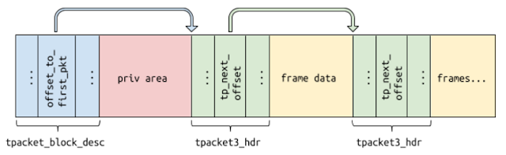
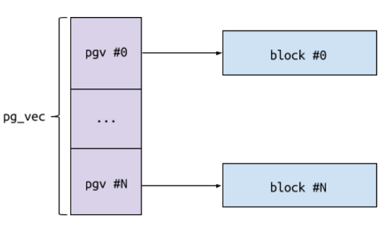

# Linux内核漏洞导致容器逃逸（CVE-2017-7308）

## 场景介绍
该漏洞影响启用`AF_PACKET`套接字（`CONFIG_PACKET=y`）配置的系统，利用漏洞需要`CAP_NET_RAW`权限，通过`user namespace`来获取。

`AF_PACKET`套接字允许用户在设备驱动程序级别上发送或接收数据包。要创建`AF_PACKET`套接字，进程必须在管理`network namespace`的`user namespace`中具有`CAP_NET_RAW`权限。

要在packet套接字上发送和接收数据包，进程可以使用`send`和`recv`系统调用。然而，通过使用内核和用户空间之间共享的循环缓冲区，packet套接字提供了一种更快地完成这一任务的方法。环形缓冲区可以通过`PACKET_TX_RING`和`PACKET_RX_RING`套接字选项来创建。用户可以mmap环形缓冲区，然后可以直接对其读取或写入数据包数据。

由于在判断收到数据的长度时存在整数溢出漏洞，导致可以通过覆盖函数指针的方式实现内核任意代码执行。利用漏洞可以进行本地提权，进而实现容器的逃逸。

## 背景知识

漏洞主要影响版本：`TPACKET_V3`，主要集中于`PACKET_RX_RING`。

### Ring buffer相关的结构体

Ring buffer储存packet的内存区域，每个packet保存在单独的帧中，帧被分组到块（block）中，TPACKET_V3的ring buffer帧的大小不固定，帧的大小只要能适应block其值是任意的。

创建TPACKET_V3，通过PACKET_RX_RING套接字选项，用户需要提供确切的参数。通过setsockopt系统调用，通过一个指向`tpacket_req3`结构体的指针。

```c
struct tpacket_req3{
	unsigned int tp_block_size; // 每个区块的大小
	unsigned int tp_block_nr; // 区块的数量
	unsigned int tp_frame_size;
	unsigned int tp_frame_nr; // 因为大小是任意的，所以这一部分被忽略了
	unsigned int tp_retire_blk_tov; // timeout after which a block is retired, even if it’s not fully filled with data (see below).
    unsigned int tp_sizeof_priv; // 每个区块private区域的大小，user可以使用这一部分储存任意信息。
	unsigned int tp_feature_req_word; // flags,启用一些额外的功能
}
```

每个区块都有一个头，叫做tpacket_block_desc：

```c
struct tpacket_block_desc{
	__u32 version;
	__u32 offset_to_priv;
	union tpacket_bd_header_u hdr;
}
```

其中包含了`block_status`域，这个域指示了区块被kernel使用或者被user使用。常见的工作流程如下：

内核把packet保存到block中直到其满，然后将`block_status`设置成`TP_STATUS_USER`，用户读要求的数据，然后再将其设置为`TP_STATUS_KERNEL`。块中的每个帧都一个头，被结构体`tpacket3_hdr`描述：

```c
struct tpacket3_hdr{
	__u32 tp_next_offset;
}
```

指向了同一区块中的下一帧：



### 内核中AF_PACKET套接字的创建

当pakcet socket被创建时，一个相关联的`packet_sock`结构体会被创建。

```c
struct packet_sock{
	struct sock sk;
	...
	struct packet_ring_buffer rx_ring;
	struct packet_ring_buffer tx_ring;
	...
	enum tpacket_versions tp_version;//TPACKET_V3
	...
	int (*xmit)(struct sk_buff *skb);
}
```

其中rx_ring和tx_ring的结构体类型如下定义：

```c
struct packet_ring_buffer{
	struct pgv *pg_vec;
	struct tpacket_kbdq_core prb_bdqc;
}
struct pgv{
	char *buffer;
}
```
`pg_vec`指向了一个pgv结构体数组，数组中的每个元素是一个block的引用，所以实际上block是被分块分配的而不是连续的一大段内存。



- 内核使用`packet_setsockopt()`函数去处理建立套接字选项
- 使用了`PACKET_VERSION`套接字后，内核会将`tp_version`设置为提供的值
- PACKET_RX_RING选项会创建receive ring buffer。通过`packet_set_ring`函数实现

## 漏洞详情

### 漏洞分析

在`packet_set_ring()`中：

```c
if (po->tp_version >= TPACKET_V3 && 
	(int)(rep->tp_block_size - BLK_PLUS_PRIV(req_u->req3.tp_sizeof_priv))<= 0 )
```

这个检查的目的是保证block头和private data的长度之和小于块的大小。

通过整数溢出：

```
A = req->tp_block_size = 4096 = 0x1000
B = req_u->req3.tp_sizeof_priv = (1 << 31) + 4096 = 0x80001000
BLK_PLUS_PRIV(B) = (1 << 31) + 4096 + 48 = 0x80001030
A - BLK_PLUS_PRIV(B) = 0x1000 - 0x80001030 = 0x7fffffd0
(int)0x7fffffd0 = 0x7fffffd0 > 0
```

在后续，`req_u->req3.tp_sizeof_priv`会在`init_prb_bdqc()`中被拷贝到`p1->blk_sizeof_priv`，由于其类型为`unsigned short`，所以会被截断。利用这个bug可以任意设置`blk_sizeof_priv`。

内核中对其有两种使用方式：

**方式一：**
在`init_prb_bdqc()`中设置`max_frame_len`，这个值表示可以保存到块中的帧的最大大小。因为已经控制了`p1->blk_sizeof_priv`，所以可以让`BLK_PLUS_PRIV(p1->blk_sizeof_priv)`的值比`p1->kblk_size`大。导致`p1->max_frame_len`有一个巨大的值。最终可以使得当一个帧被拷贝到区块中时绕过size检查，绕制堆的越界写。

**方式二：**
`prb_open_block()`，初始化一个区块，`pkc1->nxt_offset`表示地址（新的packet接收到时将要写入的地址）。内核对于block header和per-block private data不想覆盖，`pkc1->nxt_offset`指向了区块头和private数据的后面。由于已经控制了`blk_sizeof_priv`，所以控制了`nxt_offset`低两位，允许越界写。

### 漏洞利用

漏洞利用遵循以下步骤：
1. bypass KALSR
2. 构造堆布局
3. 溢出并实现内核任意代码执行
4. 关闭SMEP、SMAP
5. 提权
6. 通过切换namespace逃逸

具体可以参考poc.c文件，需要具有以下知识背景：
-[] 了解KALSR、SMEP、SMAP的原理
-[] 了解Linux系统内核内存管理的方式
-[] 对内核`task_struct`结构体有一定的了解
-[] 理解namespace、Capabilities等内核安全机制


## 环境搭建

宿主机环境：

- VMware 16.1.0
- Ubuntu 16.04

切换内核，直接通过Metarget安装环境

```
./metarget cnv install cve-2017-7308 --verbose
```

## 漏洞复现

基于本目录构建漏洞利用镜像并运行容器：

```shell
gcc -o poc poc.c
docker build -t exp .
docker run -it --rm exp
```

在容器中执行以下命令：

```bash
/poc
```

在弹出的shell中已经成功逃逸，且拥有全部的capabilities，相当于宿主机上的root拥有的权限。


## 参考文献

1. https://googleprojectzero.blogspot.com/2017/05/exploiting-linux-kernel-via-packet.html
2. https://www.cyberark.com/resources/threat-research-blog/the-route-to-root-container-escape-using-kernel-exploitation