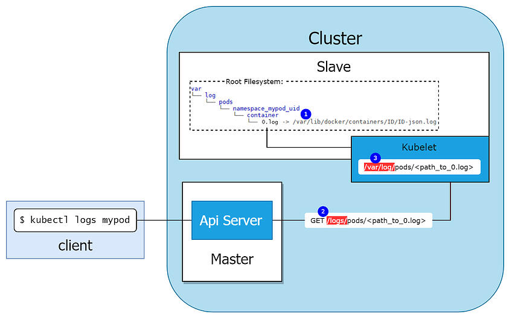
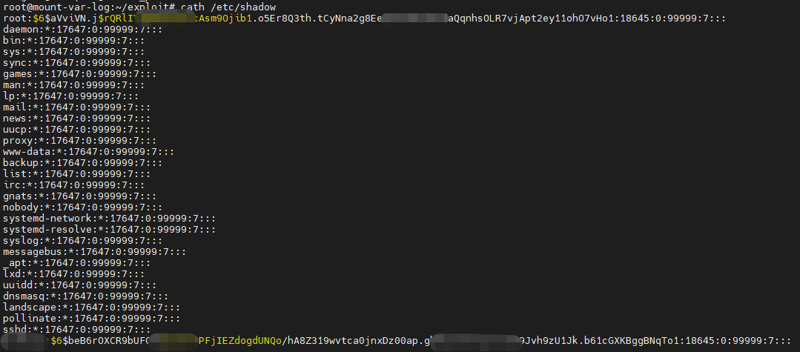

# 挂载/var/log导致容器逃逸

## 场景介绍

当pod以可写权限挂载了宿主机的/var/log目录，而且pod里的service account有权限访问该pod在宿主机上的日志时，攻击者可以通过在容器内创建符号链接来完成简单逃逸。

## 原理简介

下图展示了`kubectl logs <pod-name>` 如何从pod中检索日志：



kubelet会在宿主机上的/var/log目录中创建一个目录结构，如图符号①，代表节点上的pod。但它实际上是一个符号链接，指向/var/lib/docker/containers目录中的容器日志文件。当使用`kubectl logs <pod-name>`命令查询指定pod的日志时，实际上是向kubelet的`/logs/pods/<path_to_0.log>`接口发起HTTP请求。对于该请求的处理逻辑如下：

`kubernetes\pkg\kubelet\kubelet.go:1371`

```golang
if kl.logServer == nil {
		kl.logServer = http.StripPrefix("/logs/", http.FileServer(http.Dir("/var/log/")))
}
```

kubelet会解析该请求地址，去`/var/log`对应的目录下读取log文件并返回。当pod以可写权限挂载了宿主机上的`/var/log`目录时，可以在该路径下创建一个符号链接，指向宿主机的根目录，然后构造包含该符号链接的恶意kubelet请求，宿主机在解析时会解析该符号链接，导致可以读取宿主机任意文件和目录。

## 环境搭建

基础环境（Docker+K8s）准备（如果已经有任意版本的Docker+K8s环境则可跳过）：

```bash
./metarget gadget install docker --version 18.03.1
./metarget gadget install k8s --version 1.16.5 --domestic
```

漏洞环境准备：

```bash
./metarget cnv install mount-var-log
```

执行完成后，K8s集群内`metarget`命令空间下将会创建一个名为`mount-var-log`的pod。

宿主机的`/var/log`被挂载在容器内部且该pod有权限访问日志。

## 漏洞复现

pod内部已经内置好漏洞利用代码，可通过自定义命令读取宿主机的任意文件或目录。

执行以下命令进入容器:

```bash
kubectl exec -it mount-var-log -n metarget bash
```

在Pod内可执行以下两种命令:

```
lsh 等于宿主机上的ls
cath 等于宿主机上的cat
```



## 参考文献

1. https://blog.aquasec.com/kubernetes-security-pod-escape-log-mounts
2. https://github.com/danielsagi/kube-pod-escape
